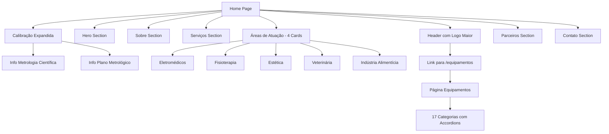

# Plano de Melhorias - Site TECHDIO

## 📋 Resumo Executivo

Este documento detalha o plano arquitetural para implementar as melhorias solicitadas no site da TECHDIO, incluindo:
- Aumento da logo
- Reorganização da seção de Áreas de Atuação (divisão hospitalar em 3 categorias)
- Expansão da seção de Calibração com informações metrológicas
- Nova seção de Parceiros
- Página dedicada para catálogo completo de equipamentos (17 categorias)

---

## 🎯 Objetivos das Mudanças

### 1. Aumentar Logo
**Objetivo:** Dar mais destaque à identidade visual da marca
**Localização:** Header do site
**Impacto:** Visual, branding

### 2. Divisão da Área Hospitalar
**Objetivo:** Especializar e detalhar os serviços por segmento
**Nova estrutura:**
- ❤️ **Eletromédicos** - Equipamentos eletrônicos médico-hospitalares
- 🦴 **Fisioterapia** - Equipamentos de reabilitação e terapia
- ✨ **Estética** - Equipamentos estéticos e dermatológicos

### 3. Expandir Seção de Calibração
**Objetivo:** Demonstrar expertise técnica e científica
**Novos elementos:**
- Informações sobre Metrologia Científica
- Detalhes sobre Plano Metrológico
- Badges de certificação expandidos

### 4. Seção de Parceiros
**Objetivo:** Estabelecer credibilidade através de parcerias
**Estrutura:** Grid de logos com preparação para fotos futuras

### 5. Página de Equipamentos
**Objetivo:** Catálogo completo e navegável dos 17 tipos de equipamentos
**Abordagem:** Página dedicada com sistema de navegação hierárquico

---

## 🏗️ Arquitetura das Mudanças

### Estrutura de Componentes

```
client/src/
├── pages/
│   ├── Home.tsx (modificar)
│   ├── Equipamentos.tsx (criar NOVO)
│   └── NotFound.tsx
├── components/
│   ├── PremiumAreaCard.tsx (modificar)
│   ├── PartnersSection.tsx (criar NOVO)
│   ├── MetrologyInfoCard.tsx (criar NOVO)
│   ├── EquipmentCategoryAccordion.tsx (criar NOVO)
│   └── EquipmentCategoryCard.tsx (criar NOVO)
└── data/
    └── equipamentos.ts (criar NOVO - dados estruturados)
```

---

## 📊 Diagrama de Fluxo da Aplicação



---

## 🎨 Design System - Novas Áreas de Atuação

### Card de Eletromédicos
```typescript
{
  title: "Eletromédicos",
  description: "Equipamentos eletrônicos médico-hospitalares de alta complexidade",
  stats: "200+",
  statsLabel: "Equipamentos/Ano",
  badge: "ANVISA RDC 611/22",
  gradient: "linear-gradient(135deg, #2563EB 0%, #1D4ED8 100%)",
  accentColor: "#2563EB",
  icon: <MedicalIcon />,
  equipment: [
    "Autoclaves e esterilizadores",
    "Monitores multiparamétricos",
    "Desfibriladores e cardioversores",
    "Bombas de infusão",
    "Ventiladores pulmonares",
    "Bisturis elétricos"
  ]
}
```

### Card de Fisioterapia
```typescript
{
  title: "Fisioterapia",
  description: "Equipamentos especializados em reabilitação e terapia física",
  stats: "80+",
  statsLabel: "Equipamentos/Ano",
  badge: "Especialização Terapêutica",
  gradient: "linear-gradient(135deg, #06B6D4 0%, #0891B2 100%)",
  accentColor: "#06B6D4",
  icon: <PhysioIcon />,
  equipment: [
    "Ultrassom terapêutico",
    "Laser terapêutico",
    "TENS e FES",
    "Ondas curtas e microondas",
    "Turbilhão e compressas",
    "Estimuladores musculares"
  ]
}
```

### Card de Estética
```typescript
{
  title: "Estética",
  description: "Equipamentos estéticos e dermatológicos de precisão",
  stats: "60+",
  statsLabel: "Equipamentos/Ano",
  badge: "Certificação Estética",
  gradient: "linear-gradient(135deg, #A855F7 0%, #9333EA 100%)",
  accentColor: "#A855F7",
  icon: <AestheticIcon />,
  equipment: [
    "Laser dermatológico",
    "Radiofrequência",
    "Criolipólise",
    "Carboxiterapia",
    "Microagulhamento",
    "Peeling ultrassônico"
  ]
}
```

---

## 📝 Seção de Calibração Expandida

### Layout Proposto

```
┌─────────────────────────────────────────────────────┐
│  Calibração de Precisão                             │
│  [Descrição existente]                              │
│                                                      │
│  ┌──────────────┐  ┌──────────────┐  ┌───────────┐│
│  │ Metrologia   │  │ Plano        │  │ Padrões   ││
│  │ Científica   │  │ Metrológico  │  │ RBC       ││
│  │ [Info Card]  │  │ [Info Card]  │  │ [Existing]││
│  └──────────────┘  └──────────────┘  └───────────┘│
└─────────────────────────────────────────────────────┘
```

### Cards de Informação

**Metrologia Científica:**
- Título: "Metrologia Científica"
- Ícone: 🔬
- Descrição: "Aplicação de métodos científicos e estatísticos para garantir a precisão e rastreabilidade das medições"
- Benefícios:
  - Rastreabilidade ao SI (Sistema Internacional)
  - Análise de incertezas
  - Validação de métodos
  - Compliance com normas internacionais

**Plano Metrológico:**
- Título: "Plano Metrológico Personalizado"
- Ícone: 📋
- Descrição: "Gestão completa do ciclo de vida dos instrumentos de medição"
- Inclui:
  - Inventário metrológico
  - Programação de calibrações
  - Controle de certificados
  - Indicadores de qualidade
  - Gestão de custos

---

## 🤝 Seção de Parceiros

### Estrutura HTML

```html
<section id="parceiros" class="...">
  <header>
    <badge>Nossos Parceiros</badge>
    <h2>Parcerias de <span class="gradient">Excelência</span></h2>
    <p>Trabalhamos com as principais empresas do setor</p>
  </header>
  
  <div class="partners-grid">
    <!-- 6-8 slots para logos de parceiros -->
    <div class="partner-card">
      
    </div>
    <!-- Mais slots... -->
  </div>
</section>
```

### Design Specifications

- **Grid:** 3 colunas desktop, 2 colunas tablet, 1 coluna mobile
- **Card size:** 200x200px (desktop), 150x150px (mobile)
- **Spacing:** gap-8 desktop, gap-4 mobile
- **Background:** glass effect com border
- **Hover effect:** scale(1.05) + glow
- **Placeholder:** Gradient + texto "Em breve"

---

## 📱 Página de Equipamentos

### Estrutura de Rotas

```typescript
// App.tsx
<Switch>
  <Route path="/" component={Home} />
  <Route path="/equipamentos" component={Equipamentos} />
  <Route path="/404" component={NotFound} />
  <Route component={NotFound} />
</Switch>
```

### Estrutura de Dados

```typescript
// data/equipamentos.ts
export interface EquipmentCategory {
  id: string;
  title: string;
  icon: string;
  description: string;
  items: string[];
  relatedNorms?: string[];
  applications?: string[];
}

export const equipmentCategories: EquipmentCategory[] = [
  {
    id: "pressao",
    title: "Instrumentos de Pressão",
    icon: "🔧",
    description: "Equipamentos para medição e controle de pressão",
    items: [
      "Manômetros analógicos & digitais",
      "Manovacuômetros",
      "Vacuômetros",
      "Transmissores de pressão (4-20mA / HART)",
      "Pressostatos",
      "Válvulas de alívio / segurança",
      // ... mais itens
    ],
    relatedNorms: ["ISO 17025", "INMETRO"],
    applications: ["Industrial", "Laboratório", "Hospitalar"]
  },
  // ... 16 categorias restantes
];
```

### Design da Página Equipamentos

#### Layout Desktop

```
┌─────────────────────────────────────────────────────┐
│  Header: CATÁLOGO DE EQUIPAMENTOS                   │
│  Subtitle: 17 Categorias | 300+ Tipos de Equip.     │
├─────────────────────────────────────────────────────┤
│                                                      │
│  [Busca/Filtro]                                     │
│                                                      │
│  ┌──────────────────────────────────────┐          │
│  │ ▼ 1. Instrumentos de Pressão         │          │
│  │   - Manômetros analógicos...         │          │
│  │   - Manovacuômetros...               │          │
│  └──────────────────────────────────────┘          │
│                                                      │
│  ┌──────────────────────────────────────┐          │
│  │ ▶ 2. Instrumentos de Temperatura     │          │
│  └──────────────────────────────────────┘          │
│                                                      │
│  ... (mais 15 categorias)                           │
│                                                      │
│  [CTA: Solicitar Orçamento]                         │
└─────────────────────────────────────────────────────┘
```

#### Componente Accordion

```typescript
// EquipmentCategoryAccordion.tsx
interface Props {
  category: EquipmentCategory;
  defaultOpen?: boolean;
}

export function EquipmentCategoryAccordion({ category, defaultOpen }: Props) {
  return (
    <AccordionItem value={category.id}>
      <AccordionTrigger>
        <div class="flex items-center gap-4">
          <span class="text-4xl">{category.icon}</span>
          <div>
            <h3>{category.title}</h3>
            <p class="text-sm text-muted">{category.items.length} tipos</p>
          </div>
        </div>
      </AccordionTrigger>
      
      <AccordionContent>
        <p class="mb-4">{category.description}</p>
        
        <div class="grid grid-cols-2 gap-2">
          {category.items.map(item => (
            <div class="flex items-center gap-2">
              <Check class="w-4 h-4 text-cyan-400" />
              <span>{item}</span>
            </div>
          ))}
        </div>
        
        {category.relatedNorms && (
          <div class="mt-4">
            <h4>Normas Relacionadas:</h4>
            <div class="flex gap-2">
              {category.relatedNorms.map(norm => (
                <Badge>{norm}</Badge>
              ))}
            </div>
          </div>
        )}
      </AccordionContent>
    </AccordionItem>
  );
}
```

---

## 🎨 Sistema de Cores para Novas Categorias

### Eletromédicos
- Primary: `#2563EB` (blue-600)
- Secondary: `#1D4ED8` (blue-700)
- Gradient: `from-blue-600 to-blue-700`

### Fisioterapia
- Primary: `#06B6D4` (cyan-500)
- Secondary: `#0891B2` (cyan-600)
- Gradient: `from-cyan-500 to-cyan-600`

### Estética
- Primary: `#A855F7` (purple-500)
- Secondary: `#9333EA` (purple-600)
- Gradient: `from-purple-500 to-purple-600`

---

## 📐 Especificações Técnicas

### Logo (Header)
**Mudança:**
```tsx
// ANTES


// DEPOIS

```

**Impacto:** Aumento de ~40% no tamanho da logo

### Navegação Atualizada
```tsx
// Adicionar novo item no menu
['sobre', 'servicos', 'areas', 'equipamentos', 'contato']
```

---

## 🚀 Plano de Implementação

### Fase 1: Mudanças Simples (1-2h)
1. ✅ Aumentar logo no header
2. ✅ Adicionar link "Equipamentos" na navegação

### Fase 2: Redesign Áreas de Atuação (2-3h)
1. ✅ Criar novos dados para Eletromédicos, Fisioterapia, Estética
2. ✅ Ajustar PremiumAreaCard para suportar novos cards
3. ✅ Atualizar grid de 3 para 5 cards (ou carrossel mobile)
4. ✅ Testar responsividade

### Fase 3: Expandir Calibração (1-2h)
1. ✅ Criar MetrologyInfoCard component
2. ✅ Adicionar seção de cards informativos
3. ✅ Integrar na seção existente de calibração

### Fase 4: Seção de Parceiros (1h)
1. ✅ Criar PartnersSection component
2. ✅ Implementar grid com placeholders
3. ✅ Adicionar animações e effets

### Fase 5: Página de Equipamentos (3-4h)
1. ✅ Criar estrutura de dados (equipamentos.ts)
2. ✅ Criar página Equipamentos.tsx
3. ✅ Implementar EquipmentCategoryAccordion
4. ✅ Adicionar busca/filtro (opcional)
5. ✅ Configurar rota no App.tsx
6. ✅ Testar navegação completa

### Fase 6: Testes e Ajustes (1h)
1. ✅ Testar responsividade mobile/desktop
2. ✅ Validar SEO (meta tags, schema)
3. ✅ Verificar performance
4. ✅ Ajustes finais de design

**TEMPO TOTAL ESTIMADO:** 9-13 horas

---

## 📱 Responsividade

### Breakpoints
- Mobile: < 768px
- Tablet: 768px - 1024px
- Desktop: > 1024px

### Áreas de Atuação
- **Desktop:** Grid 5 colunas (se couber) ou 3-2
- **Tablet:** Grid 2 colunas + scroll horizontal
- **Mobile:** Carrossel com swipe

### Página Equipamentos
- **Desktop:** Sidebar + conteúdo (opcional)
- **Tablet/Mobile:** Accordion vertical

---

## ✅ Checklist de Validação

### Design
- [ ] Logo aumentada e proporcional
- [ ] 5 cards de áreas (Eletromédicos, Fisio, Estética, Vet, Indústria)
- [ ] Cards de metrologia visíveis e informativos
- [ ] Seção de parceiros com placeholders
- [ ] Página equipamentos navegável

### Funcionalidade
- [ ] Navegação funciona em todos os links
- [ ] Accordions abrem/fecham corretamente
- [ ] Scroll suave entre seções
- [ ] WhatsApp flutuante funcionando
- [ ] CTAs redirecionam corretamente

### Performance
- [ ] Imagens otimizadas
- [ ] Lazy loading implementado
- [ ] Animações suaves (sem lag)
- [ ] Tempo de carregamento < 3s

### SEO
- [ ] Meta tags atualizadas
- [ ] Schema.org atualizado
- [ ] Alt texts em todas imagens
- [ ] URLs amigáveis

---

## 🎯 Métricas de Sucesso

1. **Visual Impact:** Logo 40% maior ✓
2. **Especialização:** 5 áreas específicas vs 3 genéricas ✓
3. **Informação:** 2 novos cards de metrologia ✓
4. **Credibilidade:** Seção de parceiros ✓
5. **Catálogo:** 300+ equipamentos catalogados ✓

---

## 📞 Próximos Passos

Após aprovação deste plano:

1. Cliente revisar e aprovar arquitetura
2. Confirmar textos e descrições das novas categorias
3. Fornecer logos de parceiros (quando disponível)
4. Validar lista completa de equipamentos
5. **Iniciar implementação no modo Code**

---

## 💡 Sugestões Adicionais

### Melhorias Futuras (Opcional)
1. **Sistema de Busca:** Buscar equipamentos por nome/categoria
2. **Sistema de Filtros:** Filtrar por normas, aplicações
3. **Detalhes do Equipamento:** Modal com mais info sobre cada equip.
4. **Calculadora de Calibração:** Estimar custo/prazo de calibração
5. **Blog/Recursos:** Artigos sobre metrologia e manutenção
6. **Portal do Cliente:** Área para acompanhar serviços

---

## 📊 Estrutura de Arquivos Final

```
client/
├── src/
│   ├── pages/
│   │   ├── Home.tsx (modificado)
│   │   ├── Equipamentos.tsx (novo)
│   │   └── NotFound.tsx
│   ├── components/
│   │   ├── PremiumAreaCard.tsx (modificado)
│   │   ├── PartnersSection.tsx (novo)
│   │   ├── MetrologyInfoCard.tsx (novo)
│   │   ├── EquipmentCategoryAccordion.tsx (novo)
│   │   └── EquipmentCategoryCard.tsx (novo)
│   ├── data/
│   │   └── equipamentos.ts (novo)
│   └── App.tsx (modificado - nova rota)
└── public/
    └── parceiros/ (pasta para logos futuros)
```

---

**Documento preparado para aprovação do cliente.**
**Versão: 1.0**
**Data: 2024**